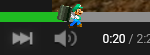
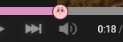

  

The secret ingredient for a older (and better) looking YouTube.

## Screenshots.

  
   
  <a href="docs/2015/photos.md">2015 Screenshots here</a>

   
   

  
   
  <a href="docs/2012/photos.md">2012 Screenshots here</a>

   
   

  
   
  <a href="docs/2010/photos.md">2010 Screenshots here</a>

## The Backstory...
This is basically the continuation of my userscript, [YT-HTML5-Player](https://github.com/ktg5/YT-HTML5-Player/). The reason I made the script into a extension is because it's easier to install & manage, more people could find the script, no need for userscript extension like Tampermonkey, plus synced settings across devices connected to the same account on your browser.

It was also getting to a point where I couldn't fix certain issues, or some issues could be fixed but it would also break something else. So I said, "Screw it!", and made the script into a browser extension!

## Somethings that this extensions does...
### User customization!
If you wanted to edit the look of the player:
1. Open up the menu at the top right of your YouTube page.
2. Scroll down to "Import, Copy, or Reset Settings".
3. Copy the code from one of the examples below or somewhere else, and paste it into the big text box in the menu.
4. Click on the "Apply settings" button, and reload the page!

Some examples:

  
  
Luigi theme v1.1 | <a href="https://github.com/ktg5/YT-HTML5-Player/blob/main/docs/custom-scripts/luigi-player.json">View the code</a>

   
   
  
  
  
Kirby theme v1.1 | <a href="https://github.com/ktg5/YT-HTML5-Player/blob/main/docs/custom-scripts/kirby-player.json">View the code</a>

## How to work.
### Stable / Web-store builds.
At the moment, I haven't uploaded the extension to any web-stores, since there are still some issues I need to get my hands on.

Please use the Beta / Dev instructions below.

### Beta / Dev builds.
For those who want the features right now, here's what you gotta do:
1. ⚠️ IMPORTANTE!!! ⚠️ Make sure you're logged into a GitHub account, or else you can't download any files from the Actions tab, which is where the Beta / Dev builds are stored.
2. Go to the [`PlayerTube build-n-pack` workflow in the Actions tab](https://github.com/ktg5/PlayerTube/actions/workflows/build.yml) and click on the latest workflow run at the top of the list.
3. Download the Artifact for your browser (For Chrome, Opera, or Brave users: get the Chromium Build. For Firefox-based users: get the Firefox build).
4. If you're not using Firefox, extract all the files from the ZIP file into a folder.
5. Load the extension on your browser, which is different for each browser.
### Chromium browsers (Chrome, Opera, Brave).
* For Chromium-based browsers, open a new tab and go to `chrome://extensions`.
* Make sure the `Developer mode` switch is enabled at the top right.
* Click on `Load unpacked` at the top left, and navigate to the folder which has the extension.
### Firefox-based browsers!!!
* Go to `about:debugging#/runtime/this-firefox`
* Click on `Load Temporary Add-on` at the top, and navigate to the ZIP file which has the extension.