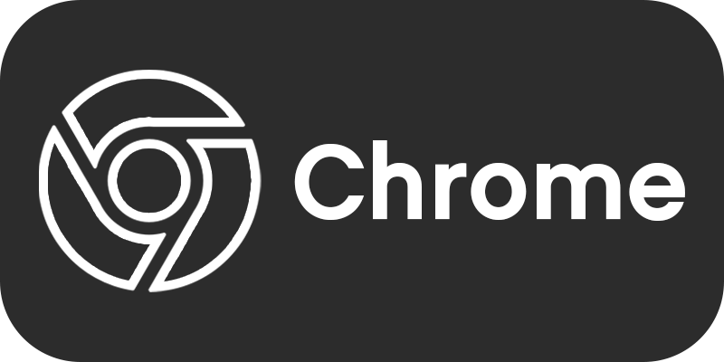

  

The secret ingredient for a older (and better) looking YouTube.

  
  
  

## Screenshots.

  
   
  <a href="docs/2013/photos.md">2013 Screenshots here</a>

   
   

  
   
  <a href="docs/2012/photos.md">2012 Screenshots here</a>

   
   

  
   
  <a href="docs/2010/photos.md">2010 Screenshots here</a>

   
   

  
   
  <a href="docs/2006/photos.md">2006 Screenshots here</a>

## The Backstory...
This is basically the continuation of my userscript, [YT-HTML5-Player](https://github.com/ktg5/YT-HTML5-Player/). The reason I made the script into a extension is because it's easier to install & manage, more people could find the script, no need for userscript extension like Tampermonkey, plus synced settings across devices connected to the same account on your browser.

It was also getting to a point where I couldn't fix certain issues, or some issues could be fixed but it would also break something else. So I said, "Screw it!", and made the script into a browser extension!

## Somethings that this extensions does...
### Many different years & styles!
Well, didn't you see the screenshots above?

### User customization!
The `Custom Theme Settings` page of the PlayerTube extension is the heart for creativity. To start on making your own custom theme, enable the `Toggle Custom Theme` option in the `Custom Theme Settings` section. Then, close and re-open the PlayerTube settings and scroll down to the same section.

If the `Toggle Custom Theme` is set to enabled, users will be able to change the look their YouTube player. Play around with each setting, and make sure to read each option's description to better understand it's intention and possible shortcuts. Each setting can be reset by clicking on the undo button on the right of the option's input.

When you're done with customizing your theme, you can copy it's code by scrolling down to the `Import, Copy, or Reset Settings`, and copying the code inside of the text box before the `Apply Settings` button.
In the future, I'd like to have a page for users to upload their own themes, but as of now, there isn't a such thing like that.

**Or, if you were to be copying a theme from someone else...:**
1. Open up the PlayerTube popup menu.
2. Scroll down to `Import, Copy, or Reset Settings`.
3. Copy the code from one of the examples below or somewhere else, and paste it into the big text box in the menu.
4. Click on the `Apply Settings` button, and reload the YouTube page!

Here's some examples provided by your's truly:

  
  
Luigi theme v1.2 | <a href="https://github.com/ktg5/PlayerTube/blob/main/docs/custom-scripts/luigi-player.json">View the code</a>

   
   
  
  
  
Kirby theme v1.1 | <a href="https://github.com/ktg5/PlayerTube/blob/main/docs/custom-scripts/kirby-player.json">View the code</a>

   
  

You may edit these examples as much as you'd like, or use them as a template for your own theme!

## How to work.
### Stable / Web-store builds.
 

### Beta / Dev builds.
For those who want the newest of features right now, here's what you gotta do:
1. ⚠️ IMPORTANTE!!! ⚠️ Make sure you're logged into a GitHub account, or else you can't download any files from the Actions tab, which is where the Beta / Dev builds are stored.
2. Go to the [`PlayerTube build-n-pack` workflow in the Actions tab](https://github.com/ktg5/PlayerTube/actions/workflows/build.yml) and click on the latest workflow run at the top of the list.
3. Download the Artifact for your browser (For Chrome, Opera, or Brave users: get the Chromium Build. For Firefox-based users: get the Firefox build).
4. If you're not using a Firefox-based browser, extract all the files from the ZIP file into a folder.
5. Load the extension on your browser, which is explained below.
### Chromium browsers (Chrome, Opera, Brave).
* For Chromium-based browsers, open a new tab and go to `chrome://extensions`.
* Make sure the `Developer mode` switch is enabled at the top right.
* Click on `Load unpacked` at the top left, and navigate to the folder which has the extension.
### Firefox-based browsers!!!
* Go to `about:debugging#/runtime/this-firefox`
* Click on `Load Temporary Add-on` at the top, and navigate to the ZIP file which has the extension.

## If you're awesome, build it yourself!
So, you like to build stuff yourself? Well, here's how to do it.
* ⚠️ IMPORTANTE!!! ⚠️ Make sure you have Node.js & NPM installed, 'cuz the build script uses it!!!!
1. Download le code `git clone https://github.com/ktg5/PlayerTube.git`
2. Install the NPM modules `npm i`
3. Run the build script `npm start`
4. Once the building script is done and no errors appear, follow the instructions for [loading the extension for your browser](https://github.com/ktg5/PlayerTube#chromium-browsers-chrome-opera-brave) via the "Beta / Dev builds" instructions

   
   

  
Built with stupidity by

  

